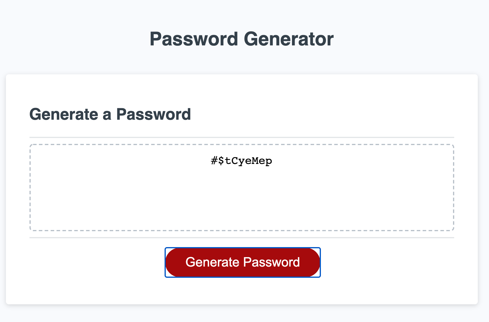

# Password Generator

## Purpose
Automatically generate a strong, randomized password for employees. Uses any character types of employee's choosing. 

## Built With
Languages Used: HTML, CSS, & JavaScript

## Website
https://clu-codes.github.io/Password-Generator/

## Image
